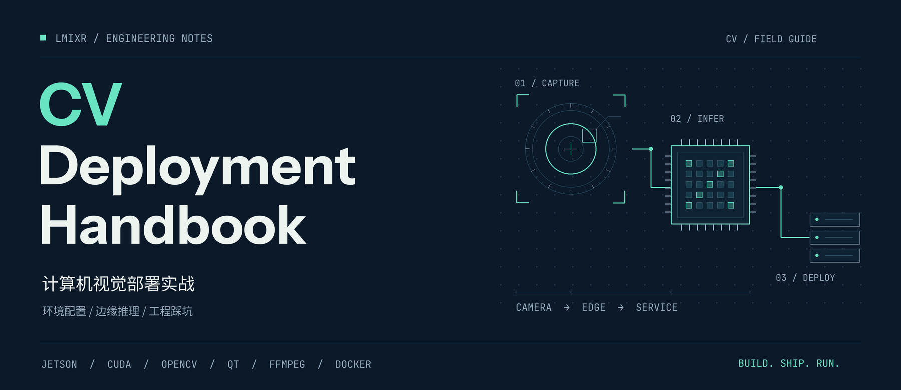

  

<h1 align="center">计算机视觉部署实战</h1>

记录 CV 工程落地中的环境配置、依赖编译、视频接入与部署经验。

  <a href="#从这里开始">从这里开始</a> ·
  <a href="#技术导航">技术导航</a> ·
  <a href="https://github.com/LMIXR/helpfile/issues">问题与补充</a> ·
  <a href="README.en.md">English</a>

---

从一台刚装好的 Ubuntu 主机，到 Jetson 上运行的视觉应用，模型之外还有许多工程细节需要处理。这里汇集了这些过程中的操作笔记：GPU 环境、推理依赖、Qt / C++ 集成、流媒体服务，以及支撑应用运行的数据库和运维工具。

文档按工具与平台组织，适合遇到具体问题时查阅。各篇记录对应的系统与软件版本可能不同，使用时请结合文中的版本和路径。

## 从这里开始

| 你正在做什么 | 推荐入口 |
| --- | --- |
| 配置一台 GPU 开发或部署主机 | [Ubuntu 系统](ubuntu/系统.md) → [显卡环境](ubuntu/显卡环境.md) → [CUDA](ubuntu/cuda.md) |
| 在 Jetson 上部署视觉应用 | [Jetson Nano](ubuntu/JetsonNano.md) / [Xavier NX](ubuntu/JetsonXavierNX.md) → [Qt on Jetson](qt/jetson/qt.md) |
| 编译图像处理与推理依赖 | [OpenCV / C++](qt/ubuntu/opencv.md) · [PyTorch](python/pytorch.md) · [tkDNN](tkdnn/ubuntu.md) |
| 接入摄像头、处理视频流 | [FFmpeg](qt/ubuntu/ffmpeg.md) · [GStreamer RTSP](qt/ubuntu/gst-rtsp-server.md) · [GB28181](流媒体/GB28181.md) |
| 打包程序并部署服务 | [Qt 打包](qt/ubuntu/打包/打包.md) · [可执行文件部署](qt/ubuntu/打包/可执行文件.md) · [Docker](docker/docker.md) |

## 技术导航

### 01 / 系统与边缘设备

操作系统、GPU 环境与设备配置。

| 方向 | 文档 |
| --- | --- |
| Ubuntu 基础 | [系统](ubuntu/系统.md) · [软件包](ubuntu/包.md) · [更换源](ubuntu/更换源.md) |
| GPU 与计算环境 | [显卡环境](ubuntu/显卡环境.md) · [CUDA](ubuntu/cuda.md) |
| 边缘设备 | [Jetson Nano](ubuntu/JetsonNano.md) · [Jetson Xavier NX](ubuntu/JetsonXavierNX.md) · [树莓派](ubuntu/树莓派.md) · [RK3399](ubuntu/rockrk3399.md) |
| 网络与远程访问 | [网卡](ubuntu/网卡.md) · [SSH](ubuntu/ssh配置.md) · [VNC](ubuntu/vnc.md) · [代理](ubuntu/代理.md) |

### 02 / 视觉与推理

图像处理库、深度学习框架及推理依赖的安装与编译。

- **OpenCV**：[C++ / Ubuntu](qt/ubuntu/opencv.md) · [Python](python/opencv.md)
- **深度学习与推理**：[PyTorch](python/pytorch.md) · [Paddle](paddle/ubuntu.md) · [tkDNN / TensorRT 依赖](tkdnn/ubuntu.md)
- **相关环境**：[Python](python/ubuntu.md) · [SeetaFace](qt/ubuntu/seetaface.md)

### 03 / 视频与摄像头接入

编解码、媒体依赖、设备协议与流媒体服务。

- **FFmpeg**：[Ubuntu](qt/ubuntu/ffmpeg.md) · [Windows](qt/windows/ffmpeg.md) · [CentOS](qt/centos/ffmpeg.md)
- **GStreamer**：[RTSP 服务](qt/ubuntu/gst-rtsp-server.md) · [Qt 多媒体依赖](qt/ubuntu/media.md)
- **设备与平台接入**：[ONVIF / Ubuntu](qt/ubuntu/onvif.md) · [ONVIF / Windows](qt/windows/onvif.md) · [GB28181 / WVP / ZLMediaKit](流媒体/GB28181.md)

### 04 / Qt 与 C++ 工程

跨平台开发环境、第三方库与发布打包。

| 方向 | 文档 |
| --- | --- |
| Qt 环境 | [Ubuntu](qt/ubuntu/qtsdk.md) · [Windows](qt/windows/qtsdk.md) · [Jetson](qt/jetson/qt.md) · [添加组件](qt/添加组件.md) |
| 构建工具 | [GCC](qt/ubuntu/gcc.md) · [CMake / Windows](qt/windows/cmake.md) |
| 常用依赖 | [Boost](qt/ubuntu/boost.md) · [OpenSSL](qt/ubuntu/openssl.md) · [yaml-cpp](qt/ubuntu/yamlcpp.md) · [ZeroMQ](qt/ubuntu/zeromq.md) · [Thrift](qt/ubuntu/thrift.md) |
| 发布与打包 | [Ubuntu 打包](qt/ubuntu/打包/打包.md) · [可执行文件](qt/ubuntu/打包/可执行文件.md) · [Windows 打包](qt/windows/打包.md) |
| 按平台浏览 | [Ubuntu](qt/ubuntu/) · [Windows](qt/windows/) · [macOS](qt/macos/) · [Jetson](qt/jetson/) |

### 05 / 数据与消息服务

应用配套的数据存储、缓存与消息组件。

- **数据库**：[MySQL](mysql/ubuntu.md) · [MySQL 主从复制](mysql/主从复制.md) · [MongoDB](mongo/ubuntu.md)
- **缓存与对象存储**：[Redis](redis/ubuntu.md) · [MinIO](minio/ubuntu.md)
- **消息与采集**：[Kafka / Ubuntu](kafka/ubuntu.md) · [Kafka / Windows](kafka/windows.md) · [Flume](flume/windows.md)

### 06 / 部署与运维

容器、持续集成、自动化与服务管理。

- **容器**：[Docker](docker/docker.md) · [Swarm](docker/swarm.md) · [Portainer](docker/portainer.md) · [ELK](docker/elk.md)
- **持续集成**：[Jenkins 安装](jenkins/安装.md) · [配置](jenkins/配置.md) · [项目](jenkins/项目.md)
- **自动化**：[Ansible](ansible/安装.md) · [Semaphore](ansible/semaphore.md)
- **服务管理**：[Nginx / Windows](nginx/windows/nginx.md) · [Tomcat / Ubuntu](tomcat/ubuntu.md) · [Windows 服务](windows/服务.md) · [Ubuntu 维护脚本](ubuntu/脚本/)

其他工具与平台笔记

- [Jitsi](jitsi/ubuntu.md) · [PHP](php/ubuntu.md) · [雷达](雷达/ubuntu.md)
- [Android 代理](android/代理.md) · [iOS CocoaPods](ios/pod.md)
- [Uncrustify 代码格式化](代码格式化/uncrustify/macos.md)

## 问题与补充

发现步骤失效、有更简洁的配置方法，或希望补充新的部署场景，可以通过 [GitHub Issues](https://github.com/LMIXR/helpfile/issues) 反馈。描述时请附上操作系统、硬件、软件版本和相关报错，方便定位问题。
