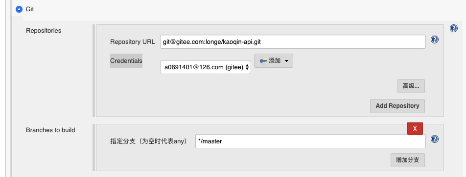
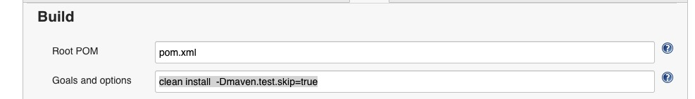
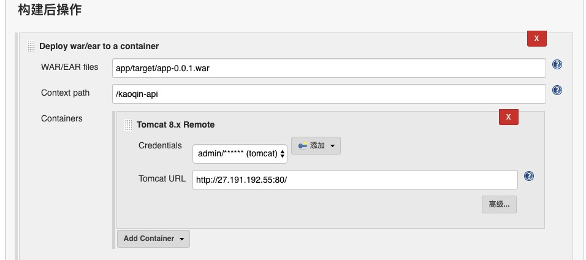

# 项目

## 配置

1. 输入项目名称，选择“构建一个maven项目”。
2. 源码管理：选择“Git”，“Repository URL”输入“ssh”地址，“Credentials”选择配置了SSH的账号。
    
3. Build：“Goals and options“输入`clean install  -Dmaven.test.skip=true`。
    
4. 构建后操作：“WAR/EAR files”输入war包路径，相对于项目文件夹。“Context path”输入部署后文件名。“Containers”输入远程Tomcat远程账号
    
 

